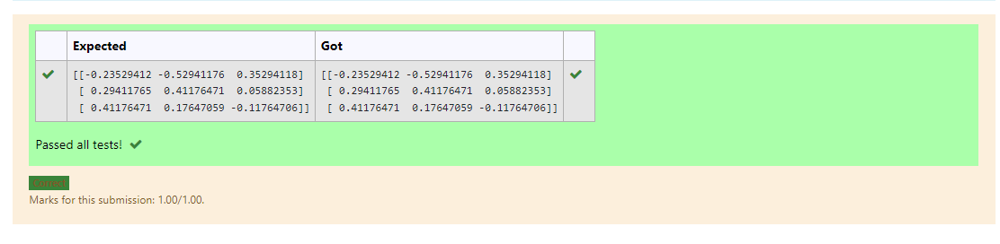

# INVERSE-OF-A-MATRIX
## Aim:
To write a python program to find the inverse of a matrix
## Equipment’s required:
1. 	Hardware – PCs
2. 	Anaconda – Python 3.7 Installation / Moodle-Code Runner
## Algorithm:
### Step1 : import numpy module as np
### Step 2: get a input values from user and stored in a.
### Step 3:  Using the np.linalg.inv(a),  we get two results (first is eigenvalue and second is eigenvector) of the given matrix.
### Step 4: print the values and end the program

## Program:
```
import numpy as np
a=np.array([[1,0,3],[-1,2,-2],[2,3,-1]])
sol=np.linalg.inv(a)
print(sol)
```
## Output:

## Result:
Thus the inverse of given matrix is successfully solved using python program

